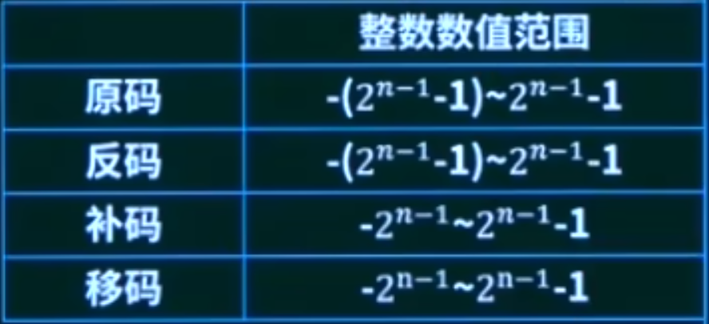

# 嵌入式系统设计师教程 学习笔记
## 第一章.计算机系统基础知识
## 分值概要(选择题占比4分左右)
### 1、数值转换
### 2、数据的表示
### 3、计算机的组成（常考）
### 4、流水线
### 5、多级存储结构
### 6、I/O控制方式（重要）
### 7、可靠性、校验码（公式）
## 考点1、数的转换
十进制D、二进制B、八进制Q、十六进制H之间的转换

典型例题

***总结：任意进制转十进制：按权展开；十进制转任意进制：短除求余***
***还有一种考法是内存的计算，需要掌握bit、Byte的关系等不再赘述***

## 考点2、数的表示
码制：原码、反码、补码、移码
原码：第一位为符号位，正数为0，负数为1
反码：正数和原码相同，负数符号位不变，其他位取反
补码：正数和原码相同，负数在反码的基础上＋1
移码：符号位取反，其他位和补码相同
补码常用于加减运算
移码常用于浮点数的阶码
取值范围如下：（早年常考）
